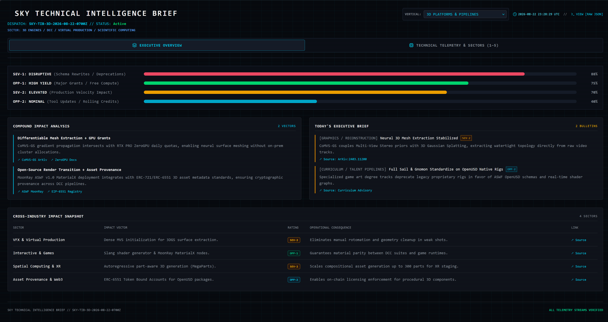
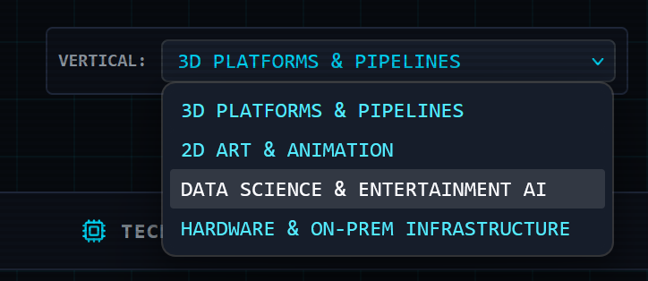
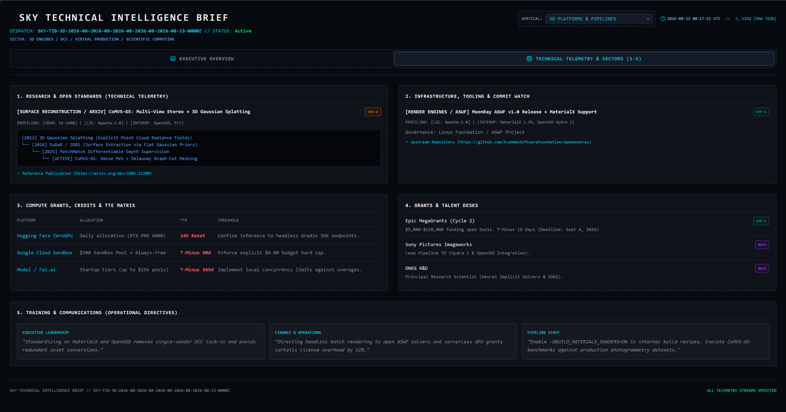

<!-- README.md Banner -->
# SKY TECHNICAL INTELLIGENCE BRIEF (SKY-TIB)

An automated, schema-validated intelligence ingestion engine that extracts, deduplicates, and compiles weekly technical updates across computer science research and security vulnerability disclosures. High-density visibility focused on 3D platforms, scientific computing, graphics pipelines, digital asset provenance, and production compute infrastructure for VFX, gaming, and digital entertainment pipelines.

<div align="center">
  
</div>

<p align="center">
  <a href="https://github.com/skyvalenti/Technical-Intelligence-Brief/actions/workflows/deploy.yml"></a>
  
  <br />
  <a href="https://skyvalenti.github.io/Technical-Intelligence-Brief/"></a>
  
  
  
</p>

<p align="center">
  <em>Automated Data Acquisition Sequence. Once implemented, the local development server will open automatically. The dashboard interface can then be tested by utilizing the vertical dropdown to verify that dynamic, client-side loading of different telemetry payloads (e.g., the Data Science & Entertainment AI vertical) functions as designed.</em>
</p>

---

## 1. System Architecture & Methodology

SKY-TIB operates on an asynchronous static decoupled architecture:
1. **Ingestion Runners**: Python workers query upstream APIs, RSS feeds, commit tracks, and academic indices (arXiv `cs.GR`/`cs.CV`, ASWF repositories, Academy Software Foundation, Khronos Group, Hugging Face, Epic Games).
2. **Deterministic Normalization**: Telemetry data is parsed, deduplicated, and mapped into structured JSON schemas (`src/data/sky_tib_*.json`).
3. **Static Telemetry Interface**: A Vite/React client renders the data via a terminal-styled interface designed for rapid technical parsing.
4. **CI/CD Orchestration**: GitHub Actions runs scheduled cron jobs (3x daily: 06:00, 14:00, 22:00 UTC) to fetch updates, commit fresh payloads, and rebuild GitHub Pages statically at zero cloud hosting cost.

---

## 2. Core Functional Modules

* **Compound Impact Analysis**: Synthesizes cross-cutting disruptions (e.g., neural geometry extraction intersecting with serverless GPU grant allocations).
* **Dynamic Metric Tracks**: Live progress bars tracking daily severity levels (`SEV-1 Disruptive`, `OPP-1 High Yield`, `SEV-2 Elevated`, `OPP-2 Nominal`) paired with contextual driver annotations.
* **Cross-Industry Impact Snapshot**: Itemized operational consequences mapped across VFX, Virtual Production, Games, XR, and Digital Asset Provenance.
* **Deep Telemetry Desks (Sections 1–5)**:
  * *1. Research & Open Standards*: Academic paper telemetry with lineage tree mapping and compute profiling.
  * *2. Infrastructure & Commit Watch*: Open-source standard watchlists (OpenUSD, MaterialX, OpenVDB).
  * *3. Compute & TTE Matrix*: Developer GPU quotas, sandbox credits, and cost-avoidance thresholds.
  * *4. Grants & Talent Desks*: Grant deadlines and Lead Pipeline TD / Research Scientist job openings.
  * *5. Operational Directives*: Actionable briefing scripts tailored for Leadership, Finance, and Engineering.

---

## 3. Interface & Telemetry Views

### 1. Multi-Domain Vertical Routing
Switch between discrete entertainment pipeline sectors using the top-level selector:

<div align="center">
  
</div>

---

### 2. Sector Telemetry & Engineering Desks
The secondary view provides deep operational analysis across academic literature, infrastructure commits, and compute quotas:

<div align="center">
  
</div>

---

## 4. Production Use Cases

* **Pipeline Technical Directors (TDs)**: Monitor breaking schema rewrites, Hydra render delegate updates, and upstream DCC commit branches.
* **R&D Engineers & Research Scientists**: Track state-of-the-art reconstructive algorithms (3DGS, neural implicit solvers) with verified open code/weights.
* **Studio Operations & Finance**: Monitor active GPU grant programs (Hugging Face ZeroGPU, Google Cloud Sandbox, Modal/Fal.ai) to eliminate compute overages.

---

## 5. Deployment & Execution Modes

### Mode 1: Zero-Install Desktop App (PWA / Taskbar Mode)
For non-developers and production consumption without keeping terminal processes running in the foreground.

#### Why Use App Mode?
* **Zero Overhead**: Does not consume local compute, memory, or open ports via local build servers.
* **Automated Data Feed**: Reads telemetry synced directly from the 3x daily ingestion pipeline on GitHub Actions.
* **Isolated Window**: Operates in an uncluttered, borderless window with native Windows Start Menu and Taskbar integration.

#### Browser Setup Instructions
* **Google Chrome**:
  1. Navigate to the live deployment: `https://skyvalenti.github.io/Technical-Intelligence-Brief/`
  2. Click the **Install** icon in the address bar, or open **Menu (⋮)** -> **Cast, save, and share** -> **Install page as app...**
  3. Once open, right-click the icon on the Windows Taskbar and select **Pin to taskbar**.
* **Microsoft Edge**:
  1. Open the deployment URL.
  2. Click **Menu (⋯)** -> **Apps** -> **Install this site as an app**.
  3. Check **Pin to taskbar** and **Pin to Start** in the post-install prompt.
* **Mozilla Firefox**:
  1. Firefox does not offer standard native desktop PWA installation by default.
  2. Open the URL and drag the padlock icon from the address bar to your Windows Desktop to generate a dedicated desktop launcher.
  3. Alternatively, install the open-source extension [Progressive Web Apps for Firefox](https://addons.mozilla.org/en-US/firefox/addon/pwas-for-firefox/) to run isolated web instances.

---

### Mode 2: Local Developer Setup

#### Prerequisites
* **Node.js**: v20.x or higher ([Download Node.js](https://nodejs.org/)) (Verify with `node -v`)
* **Python**: v3.11+ ([Download Python](https://www.python.org/downloads/windows/)) (Verify via launcher with `py --version`, or fallback `python --version` depending on PATH)
* **Pip**: Installed via Python launcher (`py -m pip install --upgrade pip` or `python -m pip install --upgrade pip`)

#### Quickstart Automation
Clone the repository and run the setup script:
```bash
git clone https://github.com/skyvalenti/Technical-Intelligence-Brief.git
cd Technical-Intelligence-Brief
setup.bat
```

#### Manual Developer Workflow
```bash
# Install dependencies
npm install
py -m pip install Pillow requests

# Fetch latest telemetry and start local server
py scripts/fetch_sky_tib.py
npm run dev
```

### Building for Production
```bash
npm run build
```

---

## Technical Reference & Learning Topics

* **Standards Bodies**: [Academy Software Foundation (ASWF)](https://www.aswf.io/) | [OpenUSD Documentation](https://openusd.org/) | [MaterialX Specification](https://materialx.org/)
* **Toolchain Architecture**: [Vite Build Tool](https://vite.dev/) | [React Documentation](https://react.dev/) | [Tailwind CSS Engine](https://tailwindcss.com/)
* **CI/CD Telemetry Automation**: [GitHub Actions Workflow Documentation](https://docs.github.com/en/actions)

---

## Under the Hood: Intelligence Ingestion Pipeline

### Architecture Overview

```text
[Upstream Feeds: arXiv / NVD]
│
▼
[src/fetchers.py] ──> [src/schemas.py (Pydantic Validation)]
│
▼
[src/deduplicate.py (Vector Cosine Filter)]
│
▼
[Jinja2 Template Engine] ──> docs/index.md & data/latest.json
```

### Engineering Highlights

* **Deterministic Validation:** All ingested records are strictly parsed through Pydantic data schemas before storage.
* **Semantic Deduplication:** Incoming entries are matched against historical embeddings using vector similarity to eliminate duplicate reporting.
* **Zero-Cost Automation:** Runs entirely on scheduled GitHub Actions (cron) with flat-file JSON persistence and GitHub Pages deployment.
* **Test Coverage:** Full `pytest` integration asserting network timeout handling, schema integrity, and parser edge cases.

### Local Execution

1. Clone the repository:
   ```bash
   git clone https://github.com/skyvalenti/Technical-Intelligence-Brief.git
   cd Technical-Intelligence-Brief
   pip install -r requirements.txt
   pytest tests/
   python src/pipeline.py
   ```

### Repository Structure

* **`src/`**: Core Python extraction, validation, and rendering logic.
* **`templates/`**: Base dashboard layouts and markdown structure.
* **`data/`**: Timestamped archives and latest machine-readable JSON outputs.
* **`docs/`**: Rendered dashboard files served via GitHub Pages.
* **`.github/workflows/`**: CI/CD automation schedules.
