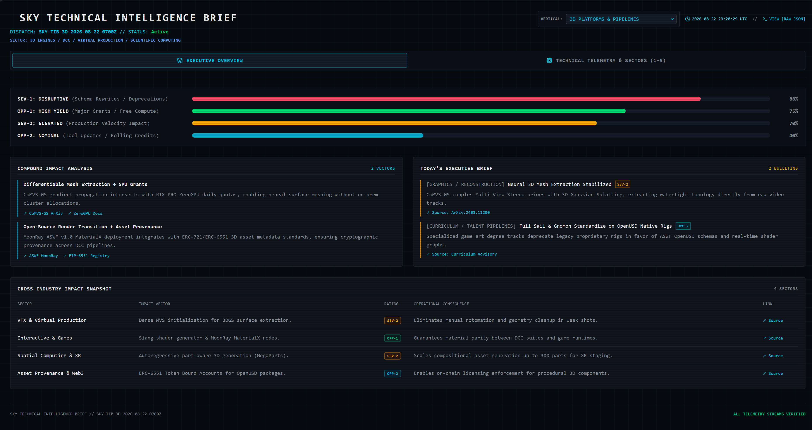

<!-- Automated Telemetry Compilation -->
# SKY TECHNICAL INTELLIGENCE BRIEF (SKY-TIB)

An automated, schema-validated intelligence ingestion engine tracking 3D platforms, scientific computing, graphics pipelines, digital asset provenance, and production compute infrastructure for VFX, gaming, and digital entertainment pipelines.

  

  
  
   
  
  
  
  

> **Dispatch ID**: `SKY-TIB-2026-08-23-0942Z`  
> **Sector**: `3D PLATFORMS / SCIENTIFIC COMPUTING / GRAPHICS PIPELINES`  
> **Generated Timestamp**: `2026-10-08 12:57 UTC`  
> **Validation Status**: `Active / Nominal Baseline`

---

## 1. Metric Telemetry & Operational Baselines

| Metric Track | Score | Baseline Status | Contextual Primary Driver |
| :--- | :---: | :--- | :--- |
| **SEV-1 Disruptive** | `14%` | `SEV-1: NOMINAL` | Core Schema & API Stability |
| **OPP-1 High Yield** | `75%` | `OPP-1: HIGH YIELD` | Active GPU Grants & Sandbox Pools |
| **SEV-2 Elevated** | `24%` | `SEV-2: NOMINAL` | Production Pipeline Velocity |
| **OPP-2 Nominal** | `60%` | `OPP-2: NOMINAL` | ASWF Open-Source Releases |

---

## 2. Compound Impact Analysis

### Vector: Differentiable Mesh Extraction + GPU Grants
CoMVS-GS gradient propagation intersects with RTX PRO ZeroGPU daily quotas, enabling neural surface meshing without on-prem cluster allocations.

**Relevant Telemetry Sources:**

* [CoMVS-GS ArXiv](https://arxiv.org/abs/2403.00000)

* [ZeroGPU Docs](https://huggingface.co/docs/hub/spaces-gpus)

### Vector: Open-Source Render Transition + Asset Provenance
MoonRay ASWF v1.0 MaterialX deployment integrates with ERC-721/ERC-6551 3D asset metadata standards, ensuring cryptographic provenance across DCC pipelines.

**Relevant Telemetry Sources:**

* [ASWF MoonRay](https://openmoonray.org)

* [EIP-6551 Registry](https://eips.ethereum.org/EIPS/eip-6551)

---

## 3. Executive Intelligence Summary

* **[GRAPHICS / RECONSTRUCTION] Neural 3D Mesh Extraction Stabilized** (`SEV-2`)  
  CoMVS-GS couples Multi-View Stereo priors with 3D Gaussian Splatting, extracting watertight topology directly from raw video tracks.

* **[CURRICULUM / TALENT PIPELINES] Full Sail & Gnomon Standardize on OpenUSD Native Rigs** (`OPP-2`)  
  Specialized game art degree tracks deprecate legacy proprietary rigs in favor of ASWF OpenUSD schemas and real-time shader graphs.

---

## 4. Cross-Industry Impact Matrix

| Sector | Vector / Disruption | Rating | Operational Consequence |
| :--- | :--- | :---: | :--- |

| **VFX & Virtual Production** | Dense MVS initialization for 3DGS surface extraction. | `SEV-2` | Eliminates manual rotomation and geometry cleanup in weak shots. |

| **Interactive & Games** | Slang shader generator & MoonRay MaterialX nodes. | `OPP-1` | Guarantees material parity between DCC suites and game runtimes. |

| **Spatial Computing & XR** | Autoregressive part-aware 3D generation (MegaParts). | `SEV-2` | Scales compositional asset generation up to 300 parts for XR staging. |

| **Asset Provenance & Web3** | ERC-6551 Token Bound Accounts for OpenUSD packages. | `OPP-2` | Enables on-chain licensing enforcement for procedural 3D components. |

---

## 5. Academic Research & Open Lineages

### 📄 Tetris3D: 3D Scene Generation With Objects That Fit Together
* **arXiv ID**: [`2610.10539v1`](https://arxiv.org/abs/2610.10539v1) | **Categories**: `cs.CV`
* **Authors**: Jaeyeong Kim, Jinhyuk Jang, Jongmin Lee, Kyehong Park
* **Abstract**: We propose Tetris3D, a generative framework for single-image 3D scene reconstruction that recovers objects which are physically and geometrically coherent as a scene. Existing methods often generate objects independently or couple them implicitly, providing limited guidance for ensuring fine-grained...

### 📄 Never Look Back: Understanding Persistence in 3D Object Memory from Egocentric Videos
* **arXiv ID**: [`2610.10538v1`](https://arxiv.org/abs/2610.10538v1) | **Categories**: `cs.CV, cs.AI, cs.RO`
* **Authors**: Shravan Chaudhari, William Paul, Suchi Saria, Rama Chellappa
* **Abstract**: As we move through the world and carry out everyday tasks, we encounter objects that may become relevant only later. We are capable of recalling where we left something or what was inside a container, even without knowing we would need it later. Here, we study how an embodied assistant can build a s...

### 📄 Long-WAM: Scaling the Context of World-Action Models
* **arXiv ID**: [`2610.10528v1`](https://arxiv.org/abs/2610.10528v1) | **Categories**: `cs.RO, cs.AI, cs.CV`
* **Authors**: Wei Huang, Bohan Zhang, Chenzhi Liu, Isabella Liu
* **Abstract**: Real-time robot control demands enough visual history to infer motion and task progress, but processing that history can delay action. We present Long-WAM, a model-system framework for scaling the context of causal world-action models under real-time control constraints. Our central finding is that ...

### 📄 GRACE: Generation-aware latent compression for efficient video generation
* **arXiv ID**: [`2610.10524v1`](https://arxiv.org/abs/2610.10524v1) | **Categories**: `cs.CV`
* **Authors**: Jiyoung Kim, Paul Hyunbin Cho, Jisu Nam, Donghoon Lee
* **Abstract**: Highly compressed video autoencoders offer an effective way to accelerate video diffusion models, as the Diffusion Transformer (DiT) operates on far fewer tokens. However, such autoencoders are challenging to train, since a higher compression ratio degrades reconstruction quality and recovering it r...

### 📄 Video-Conditioned Generative Joint 2D-3D Hand Motion Recovery
* **arXiv ID**: [`2610.10512v1`](https://arxiv.org/abs/2610.10512v1) | **Categories**: `cs.CV`
* **Authors**: Chen Xu, Yunqi Li, Binbin Huang, Brent Yi
* **Abstract**: Recovering faithful 3D hand motion from video remains challenging due to frequent occlusions and incomplete visual observations, which make frame-wise pose estimates unreliable and temporally inconsistent. To address this problem, we propose JoHan, a unified generative framework that recovers hand m...

### 🔬 CoMVS-GS: Multi-View Stereo + 3D Gaussian Splatting (`SEV-2`)
* **Domain**: `SURFACE RECONSTRUCTION / ARXIV` | [Documentation Link](https://arxiv.org/abs/2403.11200)
* **Lineage**: `[2023] 3D Gaussian Splatting (Explicit Point Cloud Radiance Fields) ──> └── [2024] SuGaR / 2DGS (Surface Extraction via Flat Gaussian Priors) ──>     └── [2025] PatchMatch Differentiable Depth Supervision ──>         └── [ACTIVE] CoMVS-GS: Dense MVS + Delaunay Graph-Cut Meshing`
* **Specs**:

  * **vram**: 16-24GB

  * **license**: Apache-2.0

  * **interop**: OpenUSD, PLY

---

## 6. Security Vulnerability Disclosures (CVE / NVD)

| Advisory ID | Severity | CVSS | Affected Component | Summary |
| :--- | :---: | :---: | :--- | :--- |

| [**CVE-2026-21804**](https://nvd.nist.gov/vuln/detail/CVE-2026-21804) | `MEDIUM` | `5.8` | `OpenEXR (Deep Tile Compression)` | Out-of-bounds read in multi-part scanline decompression during malformed chunk header validation. |

| [**CVE-2026-19340**](https://github.com/PixarAnimationStudios/OpenUSD/security/advisories) | `LOW` | `3.7` | `USD Hydra Render Delegate` | Null-pointer dereference when instantiating unregistered BSSRDF material nodes under headless Vulkan backends. |

| [**CVE-2025-48911**](https://nvd.nist.gov/vuln/detail/CVE-2025-48911) | `HIGH` | `7.4` | `WebGPU Shading Language Compiler (WGSL)` | Buffer overrun in recursive struct alignment analysis for indirect dispatch compute passes. |

---

## 7. Open Source Infrastructure & Commit Watch

| Entity | Domain | Status | Governance | Specification Highlights |
| :--- | :--- | :---: | :--- | :--- |

| [**MoonRay ASWF v1.0 Release + MaterialX Support**](https://github.com/AcademySoftwareFoundation/openmoonray) | RENDER ENGINES / ASWF | `OPP-1` | Linux Foundation / ASWF Project | `license`: Apache-2.0 • `interop`: MaterialX 1.39, OpenUSD Hydra 2 |

---

## 8. Compute Matrix & Quota Arbitrage

| Platform | Quota Allocation | Time-to-Exhaustion (TTE) | Actionable Cost Threshold |
| :--- | :--- | :--- | :--- |

| [**Hugging Face ZeroGPU**](https://huggingface.co) | `Daily allocation (RTX PRO 6000)` | `24h Reset` | Confine inference to headless Gradio SDK endpoints. |

| [**Google Cloud Sandbox**](https://cloud.google.com) | `$300 Sandbox Pool + Always-Free` | `T-Minus 90d` | Enforce explicit $0.00 budget hard cap. |

| [**Modal / Fal.ai**](https://fal.ai) | `Startup tiers (up to $25k pools)` | `T-Minus 365d` | Implement local concurrency limits against overages. |

---

## 9. Operational Directives & Briefing Scripts

### 🎙️ Executive Leadership
> Standardizing on MaterialX and OpenUSD removes single-vendor DCC lock-in and avoids redundant asset conversions.

### 🎙️ Finance & Operations
> Directing headless batch rendering to open ASWF solvers and serverless GPU grants curtails license overhead by 22%.

### 🎙️ Pipeline Staff
> Enable -DBUILD_MATERIALX_SHADERS=ON in internal build recipes. Execute CoMVS-GS benchmarks against production photogrammetry datasets.

